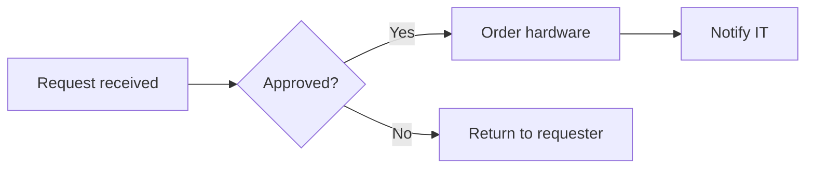
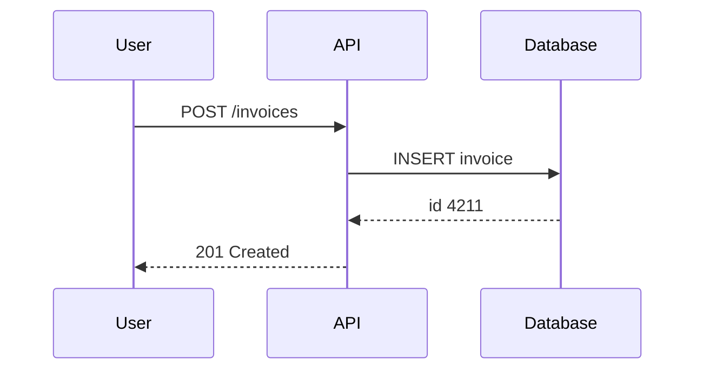
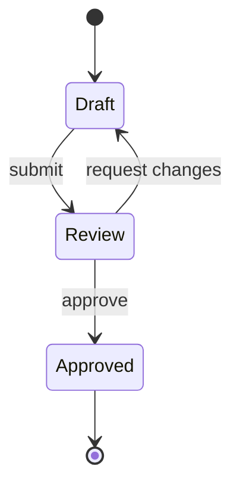
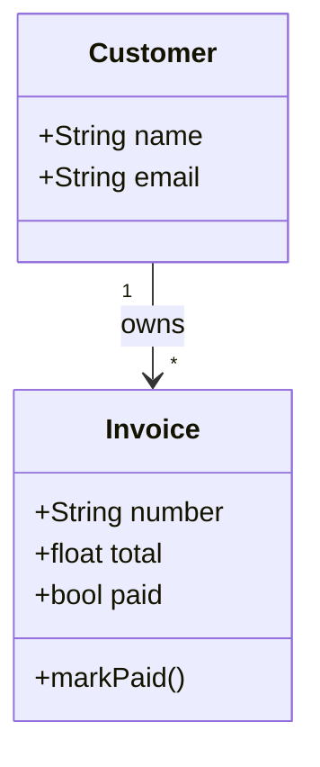

# Mermaid

## Flowchart

```mermaid
flowchart LR
    A[Request received] --> B{Approved?}
    B -- Yes --> C[Order hardware]
    B -- No --> D[Return to requester]
    C --> E[Notify IT]
```

## Sequence

```mermaid
sequenceDiagram
    participant U as User
    participant A as API
    participant D as Database
    U->>A: POST /invoices
    A->>D: INSERT invoice
    D-->>A: id 4211
    A-->>U: 201 Created
```

## State

```mermaid
stateDiagram-v2
    [*] --> Draft
    Draft --> Review: submit
    Review --> Draft: request changes
    Review --> Approved: approve
    Approved --> [*]
```

## Class

```mermaid
classDiagram
    class Invoice {
        +String number
        +float total
        +bool paid
        +markPaid()
    }
    class Customer {
        +String name
        +String email
    }
    Customer "1" --> "*" Invoice : owns
```
